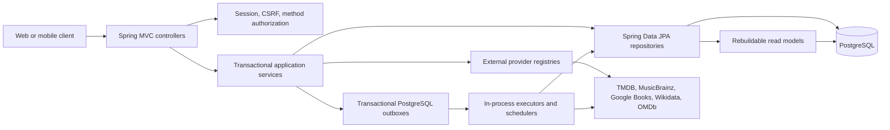
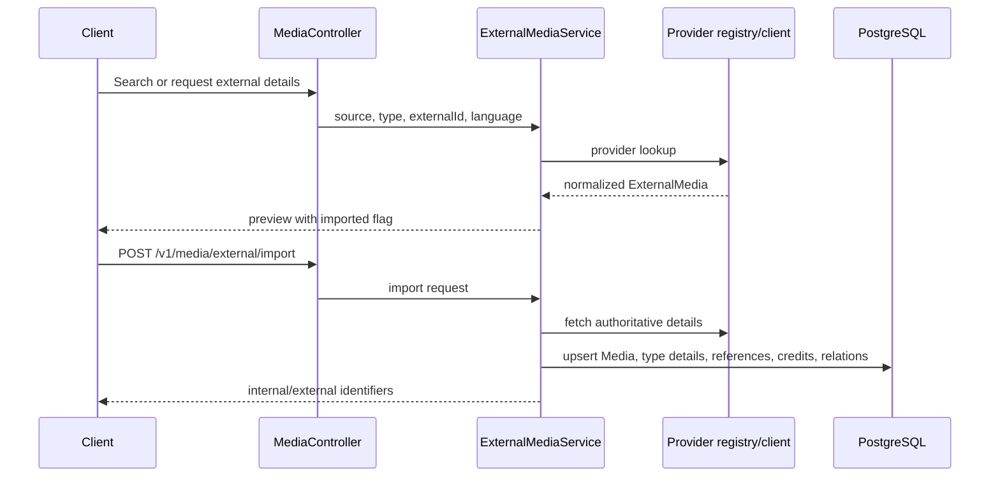

# Architecture

## System shape

Cabinet is a layered modular monolith. A single Spring Boot process owns HTTP handling, business rules, persistence, scheduling, provider calls, and SSE connections. PostgreSQL is the only durable infrastructure dependency represented in this repository.

There is no message broker, distributed cache, object store, or separate worker deployment. Asynchronous work is executed inside the API process.

PostgreSQL stores both canonical domain state and durable outbox work. Domain outbox handlers rebuild derived community-stat read models from canonical ratings, likes, list membership, and completion state. Read models and Caffeine caches are disposable accelerators; the domain tables remain authoritative.

## Package boundaries

| Package | Responsibility |
| --- | --- |
| `auth` | Login, registration handoff, logout, current session, CSRF response |
| `security` | Filter chain, authenticated principal, role resolution, CORS |
| `user` | Accounts, profiles, library, diary, episode tracking, social and interest graphs, Letterboxd import |
| `media` | Catalog and type details, external lookup/import, credits, people, ratings, reviews, likes, awards, relations, moderation |
| `lists` | Owned/public media lists, ordered membership, likes, discovery |
| `comments` | One-level comment threads on lists and reviews |
| `notifications` | Persistent notification inbox and SSE refresh signals |
| `common` | API exceptions/page wrappers and the São Paulo business date |

Modules reference each other's entities and services directly. The boundaries are organizational rather than independently deployable. In particular, community actions in `lists`, `comments`, and `media` call `NotificationService`, while `user` services depend on the media catalog.

## Layering

### Controllers

Controllers define `/v1` HTTP contracts, validate request parameters and bodies, obtain the `AuthenticatedUser`, and translate a few service outcomes into status codes. They should not contain domain logic. Public controllers accept a nullable principal so responses can include viewer-specific state when a session exists.

### Services

Services implement authorization at the resource level, business state transitions, orchestration, response assembly, and transactional boundaries. Read paths generally use `@Transactional(readOnly = true)`; writes use `@Transactional`. Domain failures are typically raised as `ApiException` with a stable code and HTTP status.

### Repositories

Spring Data JPA repositories contain derived queries and JPQL/native projections for rankings, public aggregates, search, and social pagination. Some performance behavior depends on PostgreSQL indexes added by Flyway.

### External clients and registries

Provider clients implement `ExternalMediaProvider`, `ExternalPersonWorksProvider`, or artwork provider interfaces. Registries select providers by `ExternalSource` and media type, keeping controllers and orchestration services provider-neutral.

## Core request flows

### External media to persisted catalog

The internal UUID becomes the preferred identifier after import. Re-import is idempotent around the external reference and also reconciles credits for older data.

For a MusicBrainz album, that external identity is its Release Group. The import transaction also writes a catalog-outbox request to synchronize the associated MusicBrainz Releases after commit; edition metadata is attached to the canonical album while the main import remains usable and its canonical tracklist stays unchanged.

Public media details support an additive `detailLevel=SUMMARY` representation for collection-heavy album pages. It retains the existing DTO envelope while omitting embedded track and release-version rows; clients page canonical album tracks and MusicBrainz release versions through read-only cursor endpoints. The legacy full detail and unpaginated track contracts remain during client rollout.

### Local-first media search

`GET /v1/media/search` searches persisted Cabinet media through localized PostgreSQL search documents first. The projection combines canonical and translated titles, creator credits, and alternative titles, using simple-language full-text search and trigram matching. If fewer than the requested number of local results match, the existing TMDB, MusicBrainz, and Google Books searches run as before and fill the remaining response slots. Persisted media and external previews retain their existing response distinction; search results alone never import a preview. Imports and metadata, translation, or credit changes update the local projection asynchronously through `domain_outbox_events`.

The ranking gives exact title matches a score of 100 (95 for an exact original title), title prefixes 30 (27 for an original-title prefix), and trigram similarity up to 20. Full-text relevance is a smaller additional signal; current community popularity is capped at 0.25 and release recency at 0.5, so neither can outrank a strong title match. The `simple` dictionary is used for tokenization across catalog languages, with accent folding instead of language-specific stemming.

### Community interaction

A typical write loads the authenticated user and target resource, checks visibility and release policy, then upserts or deletes a row. Likes and comments synchronize persistent notifications in the same business transaction. `NotificationChangedEvent` is emitted and handled after commit so SSE never advertises uncommitted data.

Likes, ratings, completion changes, and public-list membership also write a durable domain outbox row in the same transaction. A worker recomputes the media's community aggregates and rating distribution from canonical state. `GET /v1/media/{mediaId}/community` reads those projections and keeps indexed queries for recent likers and completers; a bounded reconciliation schedule repairs missing, dirty, or old rows.

### Stale-while-revalidate read

External availability, external ratings, and awards use persisted snapshots. A cache miss schedules a provider fetch and returns a pending response, normally as `202 Accepted` with `Retry-After: 2`. Expired data is returned as stale while an in-process worker refreshes it. Per-process in-flight sets coalesce duplicate work.

### Visibility-aware public reads

`Visibility` can be `PUBLIC`, `FOLLOWERS`, or `PRIVATE`. Public profile, diary, review, and list reads combine the resource visibility with follow/block state through services such as `SocialAccessPolicy`. Aggregate community numbers deliberately exclude private data.

### HTTP caching for public catalog resources

READY `GET /v1/media/{id}`, active `GET /v1/collections/{id}`, and active `GET /v1/franchises/{id}` responses support weak, version-based ETags and conditional `If-None-Match` requests. A matching validator returns `304` before the response body is assembled. The version key includes the canonical media version and metadata event for media, requested-locale translation timestamps, synchronized album release versions, and the relevant collection/franchise contents. Public responses use a 60-second browser freshness and a 5-minute shared-cache freshness window. Collection responses with viewer progress, authenticated franchise responses, and `/me` state explicitly use `private, no-store`.

The web application gives its server-side fetches matching 60-second media and 5-minute collection revalidation windows and locale-aware Next.js cache tags. Viewer-specific requests use `cache: 'no-store'`. Cloudflare zone cache eligibility remains deployment configuration: JSON is not cached by default unless the zone's cache rules permit it. The rule for collection/franchise paths must bypass requests carrying the Cabinet session cookie; `Vary: Cookie` alone is not a substitute for an explicit edge bypass rule. OpenNext tag-based on-demand invalidation also needs a persistent tag-cache binding before `revalidateTag` can invalidate across deployed instances; the current project has no such binding configured.

## Consistency and concurrency

- Transactions are local database transactions; no distributed transaction exists around provider calls.
- Several entities use uniqueness constraints to make upserts safe, including user/media ratings, likes, list membership, external references, and episode identity.
- `Media` and `AwardEntry` use optimistic `@Version` fields for moderator edits.
- Import application processes each Letterboxd item in `REQUIRES_NEW`, allowing partial progress and per-item failures.
- In-memory de-duplication and SSE registries are process-local. Multiple API replicas may duplicate background provider work and cannot broadcast SSE signals to connections held by other replicas.
- Episode release logic uses `America/Sao_Paulo` through `CabinetTime`; some schedulers explicitly use that zone, while media release checks and schedules without an explicit zone use the JVM's local/default time semantics.

## API response conventions

- Persisted IDs are UUIDs.
- `PageResponse<T>` is page-number based.
- `CursorPageResponse<T>` is used for social lists; its cursor is an opaque URL-safe encoding of timestamp and user ID.
- Media search has its own opaque cursor contract because relevance and rating sorts paginate differently.
- `ApiErrorResponse` contains `code`, `message`, and `fieldErrors`.
- Validation errors use `VALIDATION_ERROR`; invalid JSON uses `INVALID_REQUEST_BODY`.
- A few feature-specific exception handlers provide additional media/provider error mappings.

## Known architectural constraints

- Spring Boot Actuator exposes the configured health, info, metrics, and cache endpoints. Detailed product operations remain in the admin status API.
- Swagger paths are permitted by security but no OpenAPI library is declared.
- Flyway owns production schema changes and Hibernate uses `ddl-auto: validate`.
- Provider caches in `PersonWorksCatalogService` and in-flight work maps are in-memory and reset at restart.
- SSE is a refresh hint, not a durable event stream; REST and PostgreSQL remain the source of truth.
- Background task queues are bounded but not durable. The Letterboxd scheduler recovers jobs in `MATCHING` or `IMPORTING` at startup; other queued work is recreated only by subsequent reads or scheduled scans.
