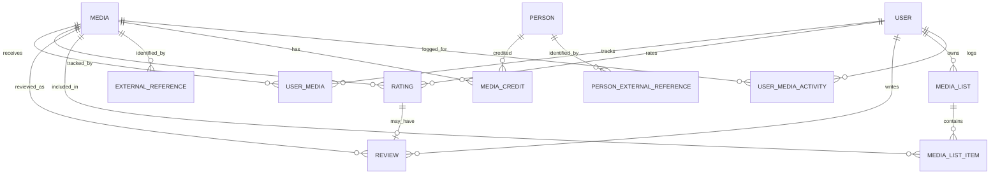

# Domain and Data Model

## Overview

The model has four central identities:

- `User` is an account and the owner/actor for community data.
- `Media` is the canonical internal identity for any catalog item.
- `Person` is the canonical identity for contributors credited on media.
- External references map internal identities to provider-specific IDs.



This diagram is deliberately compact. The sections below cover every entity group.

## Users, roles, and social relationships

### `User`

Stores username, email, BCrypt password hash, display name, biography, avatar URL, profile visibility, active state, role, account tier, denormalized follower/following counts, and audit timestamps.

Important constraints and behavior:

- Username and email are unique and searched case-insensitively by service/repository queries.
- `active=false` disables authentication.
- The persisted role defaults to `USER`; effective bootstrap admins may be supplied through `ADMIN_EMAILS`.
- Profile visibility is `PUBLIC`, `FOLLOWERS`, or `PRIVATE`.
- The Java property is named `avatarUlr` (a historical typo) while API records expose `avatarUrl`.

### Role and tier audit

`UserRoleChange` and `UserAccountTierChange` record the target, administrator, previous/new value, and timestamp. Available roles are `USER`, `MODERATOR`, and `ADMIN`; tiers are `FREE` and `PRO`.

### Social graph

`UserFollow` uses the compound identity `(followerId, followedId)` and a state of `PENDING` or `ACCEPTED`, with request and acceptance times. `UserBlock` uses `(blockerId, blockedId)`. Blocks take precedence over follow and content visibility.

Public API follow state uses `NONE`, `PENDING`, or `FOLLOWING`.

## Catalog

### `Media`

Common fields are type, title, original title, description, tagline, cover/backdrop/logo URLs, Wikidata QID, genre associations, release date, original language, country code, timestamps, and optimistic `version`. Genre identity uses a shared UUID; localized names and provider IDs are stored separately.

`MediaType` values:

| Value | Detail model | Primary provider path |
| --- | --- | --- |
| `BOOK` | `BookDetails` | Google Books |
| `MOVIE` | `MovieDetails` | TMDB |
| `SERIES` | `SeriesDetails` | TMDB |
| `ALBUM` | `AlbumDetails` | MusicBrainz |
| `TRACK` | `TrackDetails` | MusicBrainz |
| `EPISODE` | `SeriesEpisode` plus episode `Media` | TMDB through its series |

The entity stores its type through a string-backed property and converts it to `MediaType`, allowing migrations to add enum-like values without relying on PostgreSQL native enums.

### Type-specific details

- `BookDetails`: ISBN-10/13, page count, publisher, publication date, canonical work Wikidata ID.
- `MovieDetails`: runtime, budget, revenue, release date.
- `SeriesDetails`: status, season/episode counts, first/last air dates. Status is `PLANNED`, `AIRING`, `ENDED`, `CANCELLED`, or `UNKNOWN`.
- `AlbumDetails`: album type, track count, animated cover, release date. Album type is `ALBUM`, `SINGLE`, `EP`, `COMPILATION`, or `SOUNDTRACK`.
- `TrackDetails`: duration, explicit flag, track number, and optional album link.

### Series hierarchy

`SeriesSeason` is unique by `(series_media_id, season_number)` and stores external identity, descriptive fields, episode count, air date, and `episodesSyncedAt`. `SeriesEpisode` is unique by `(season_id, episode_number)` and references a unique episode-level `Media` row. It also keeps provider episode fields used for efficient season rendering.

### Album hierarchy

`AlbumTrack` connects an album `Media` to a track `Media`, while retaining MusicBrainz external ID, display title, disc/track positions, duration, and explicit flag. Album ordering is indexed by album, disc, and track number.

For MusicBrainz albums, the canonical `Media(ALBUM)` identity remains the Release Group (the musical work). `AlbumReleaseVersion` stores edition-level MusicBrainz Release metadata such as country, release date, format, barcode, catalog number, label, cover, and track count. Release IDs are unique and barcode lookup is indexed. A version points to its canonical album; editions do not create duplicate album or track media. The existing `AlbumTrack` list remains the canonical album tracklist and is not version-specific.

### External identity

`ExternalReference` maps media to an `ExternalSource`, external ID/URL, primary flag, and last synchronization time. A unique constraint prevents the same `(source, externalId)` from pointing to multiple media rows, and a second constraint allows at most one reference per `(media, source)`.

`Person` contains display metadata plus a legacy/primary external source and ID. `PersonExternalReference` gives a person multiple provider identities. `PersonIdentityService` uses these references to avoid duplicate contributors.

External sources currently enumerated are `TMDB`, `IMDB`, `GOOGLE_BOOKS`, `OPEN_LIBRARY`, `MUSICBRAINZ`, `SPOTIFY`, `APPLE_MUSIC`, `DEEZER`, `LAST_FM`, `WIKIDATA`, `JUSTWATCH`, `OMDB`, `ROTTEN_TOMATOES`, `METACRITIC`, `LETTERBOXD`, and `MANUAL`. Enumeration does not imply that every source has a direct search client.

### Credits and relations

`MediaCredit` connects a work and person with role, character name, source identity, position, and timestamps. Roles are `AUTHOR`, `CREATOR`, `DIRECTOR`, `ACTOR`, `ARTIST`, `COMPOSER`, `PRODUCER`, and `SCREENWRITER`.

`MediaRelation` is a directed edge between two different media items. Relation types are paired:

- `ADAPTATION_OF` / `ADAPTED_AS`
- `SOUNDTRACK` / `SOUNDTRACK_OF`
- `RE_RECORDING_OF` / `RE_RECORDED_AS`

## Personal catalog and activity

### Library (`UserMedia`)

One row per `(user, media)` stores status, optional progress and unit, start/completion/interaction timestamps, favorite flag, privacy flag, and audit timestamps. Status values are `PLANNED`, `IN_PROGRESS`, `COMPLETED`, `PAUSED`, and `DROPPED`. Progress units are `PERCENTAGE`, `PAGES`, `MINUTES`, `EPISODES`, and `TRACKS`.

The HTTP library contract currently changes status only; progress, favorite, and private-entry fields exist in the model for broader service/query behavior but are not all independently mutable through a dedicated controller.

### Activity and diary (`UserMediaActivity`)

An activity belongs to a user and media and contains type, occurrence/log dates, optional rating/review snapshot, spoiler flag, visibility, import source/key, tags, and creation time. The unique source key makes external import replay idempotent.

Activity types are `ADDED_TO_LIBRARY`, `STARTED`, `COMPLETED`, `PAUSED`, `DROPPED`, `WATCHED`, `REWATCHED`, `MARKED_WATCHED`, `LOGGED`, and `RELOGGED`. Diary queries use the consumption/log subset rather than every library transition.

### Episode watches

`UserEpisodeWatch` is unique by `(user, series_episode)` and stores watched and audit times. Episode ratings and diary activity still target the episode's `Media` identity.

### Personal artwork

`UserMediaArtworkPreference` is unique by `(user, media)` and stores selected cover/backdrop provider, stable asset key, and resolved URL. Supported providers are `TMDB` and `COVER_ART_ARCHIVE`. The feature is restricted to `PRO` accounts by service rules.

## Community content

### Ratings and reviews

`Rating` is unique by `(user, media)` and stores a decimal value, visibility, created/updated times, and activity time. Valid API values are 0.5 through 5.0.

`Review` references user, media, and a unique `Rating`. It stores content, spoiler flag, visibility, timestamps, and optionally the `UserMediaActivity` that generated it. Keeping ratings separate allows star-only ratings and prevents deleting review text from necessarily erasing all rating history.

`MediaLike` and `ReviewLike` are unique user/target joins. Media likes contain both legacy `createdAt` and activity-oriented `likedAt` fields.

### Lists

`MediaList` belongs to one user and stores name, description, visibility, ordered flag, cover, optional import origin, and timestamps. `MediaListItem` is unique by `(list, media)` and contains position, notes, and creation time. `MediaListLike` is the unique user/list join.

### Comments

`Comment` belongs to an author and exactly one subject: a list or review. An optional parent creates a one-level reply. It stores content, created/updated times, and `deletedAt` for tombstones.

## Notifications

`Notification` belongs to a recipient and may reference an actor, list, review, comment, report, series episode, or Letterboxd import job. It stores notification type, aggregated actor count, read time, activity time, and audit timestamps.

Types are `LIST_LIKED`, `REVIEW_LIKED`, `LIST_COMMENTED`, `REVIEW_COMMENTED`, `COMMENT_REPLIED`, `REPORT_RESOLVED`, `EPISODE_RELEASED`, `LETTERBOXD_IMPORT_READY`, and `LETTERBOXD_IMPORT_COMPLETED`. Subject columns are nullable because each type uses a different combination; service logic maintains the valid combination.

## External information and awards

### External info snapshots

`ExternalInfoSnapshot` is unique by media, kind, and region. Kinds are `AVAILABILITY` and `RATINGS`; persistent statuses are `READY`, `EMPTY`, `ERROR`, and `NOT_CONFIGURED`. It stores fetch/expiry/error metadata. The response layer adds transient section states `PENDING`, `STALE`, and `NOT_SUPPORTED`.

`MediaAvailabilityOffer` stores regional provider offers, source attribution, offer type, URL, and priority. Offer types distinguish subscription/free/ads/rent/buy/stream and download/physical music variants.

`MediaExternalRating` stores provider, displayed source, metric, numeric value, scale, display value, and provider identity. Metrics are IMDb rating, Tomatometer, and Metascore.

### Awards

`AwardEntry` belongs to exactly one subject (`Media` or `Person`) and records result, program/category/ceremony identities and labels, event date/year precision, represented work, origin, source statement/URL, curated/hidden flags, curator, timestamps, and optimistic version.

Results are `WIN` and `NOMINATION`; origins are `WIKIDATA` and `MANUAL`; date precision is `YEAR`, `MONTH`, or `DAY`. `AwardSyncState` stores per-subject synchronization status and expiry. `AwardEntryRevision` stores editor, action, and before/after JSON for audit.

## Moderation reports and revisions

`MediaReport` stores the reported internal/external identity, category and description, optional proposed target/relation, reporter/reviewer, resolution, state, and timestamps. Categories are incorrect information, duplicate, missing relation, incorrect relation, or other. State moves from `PENDING` to `APPROVED` or `REJECTED` once.

`MediaMetadataRevision` records each moderator catalog edit as before/after serialized state with editor and timestamp. `Media.version` rejects stale edit submissions.

## Interest graph

`UserInterestPreference` is unique for one user and one logical target. A target is exactly one of:

- canonical `genreId` plus a localized display label,
- `Person`, or
- `Media`.

The stored preference is `POSITIVE` or `NEGATIVE`. The computed interest graph is not persisted; it is built from explicit rows and current library/rating/credit/relation data. Recommendation source is reported as `PERSONALIZED` or `TRENDING`, with reason types `GENRE`, `PERSON`, `MEDIA`, or `TRENDING`.

## Letterboxd import

`LetterboxdImportJob` belongs to a user and stores state, item counters, error, expiry/completion, and audit timestamps. State progresses through:

```text
PARSING -> MATCHING -> READY -> IMPORTING -> COMPLETED
                                  |             or COMPLETED_WITH_ERRORS
                                  +-> CANCELLED
Any active stage may become FAILED.
```

`LetterboxdImportItem` is unique by `(job, sourceKey)` and stores parsed identity, selected media/TMDB identity, serialized source payload and candidates, override/conflict flags, state, error, and timestamps. Item states are `PENDING`, `AUTO_MATCHED`, `NEEDS_REVIEW`, `RESOLVED`, `SKIPPED`, `IMPORTED`, `PRESERVED`, and `FAILED`.

## Cross-cutting invariants

- A media release date in the future allows only `PLANNED`; it blocks ratings, reviews, diary consumption, and other consumption states.
- Public aggregates include only public community data and non-private library interactions.
- Visibility never overrides a block relationship.
- A comment cannot attach to both a list and review, and replies cannot nest more than one level.
- Ratings and reviews are separate, but a review always has a rating identity.
- External import is keyed by provider identity and should not duplicate catalog entries.
- An episode is both part of a season and an independently rateable `Media` item.
- Manual/curated award changes and catalog metadata changes are audited.
