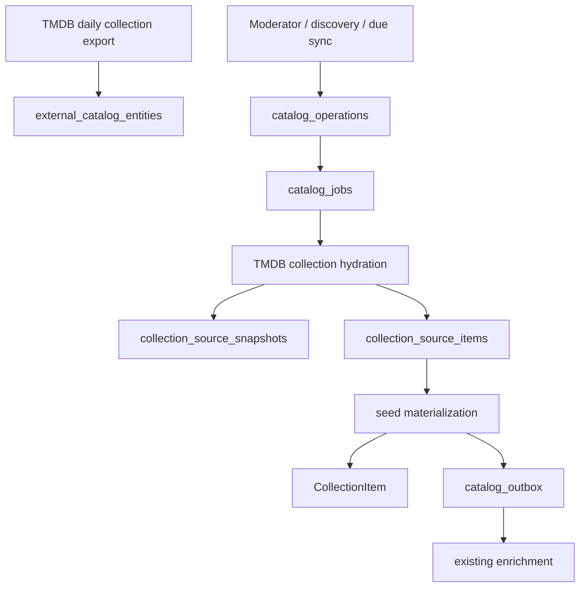

# External catalog ingestion

Cabinet treats provider identity, provider state, canonical materialization and enrichment as separate stages.

Hydration makes one collection request, stores a normalized snapshot and source manifest, then queues bounded child jobs. Child jobs reuse existing external references or create minimal `CORE_READY` media from collection seed data; the existing catalog outbox performs the remaining enrichment.

`catalog_jobs` is the durable queue. Workers claim jobs with `FOR UPDATE SKIP LOCKED`, use a bounded executor, record attempts, recover stale locks, apply jittered retry/backoff, and move permanent failures to `DEAD`. Active deduplication is enforced by a partial unique index.

Provider removals are soft removals in the source manifest. Manual `CollectionItem` relationships are never removed by provider sync. Collection fields are source-owned by default; moderator edits record `CURATOR` ownership and can be reset through the moderation API.

The public `/v1/status` remains a compact health summary. Detailed operations, jobs, attempts, events, source manifests and safe errors are exposed only through moderator endpoints and the `/moderacao/operacoes` views.

## Rollout

1. Apply `V42__external_catalog_ingestion.sql`.
2. Deploy the backend worker and APIs; existing catalog/outbox processing remains active.
3. Deploy the moderator web routes and import UI.
4. Schedule the daily TMDB identity-index job after validating provider credentials and export access.
5. Backfill existing TMDB collection references through durable sync operations.

The identity index records inexpensive existence metadata. Backfill is enabled by default and materializes every indexed collection and its movies. The dispatcher polls every minute, queues at most 1 collection per tick at backfill priority, and pauses when 20 catalog jobs are active. Set `CATALOG_TMDB_BACKFILL_ENABLED=false` to pause it. The limits can be adjusted with `CATALOG_TMDB_BACKFILL_POLL_DELAY`, `CATALOG_TMDB_BACKFILL_BATCH_SIZE`, and `CATALOG_TMDB_BACKFILL_MAX_ACTIVE_JOBS`.

The dispatcher skips collections with a TMDB source snapshot and any collection with a previous hydration job. This makes restarts safe and leaves exhausted jobs visible as `DEAD` for moderator retry rather than repeatedly requesting a failing TMDB ID. Inspect `/v1/moderation/catalog-jobs?status=DEAD` and retry after resolving failures. Each successful hydration queues movie materialization through the existing durable job pipeline. New IDs in later daily exports become eligible automatically.
