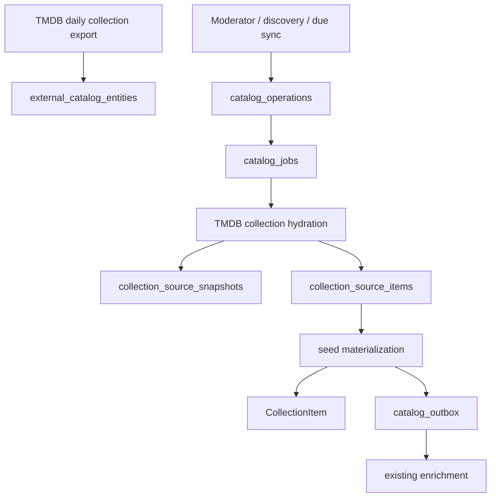

# External catalog ingestion

Cabinet treats provider identity, provider state, canonical materialization and enrichment as separate stages.

Hydration makes one collection request, stores a normalized snapshot and source manifest, then queues bounded child jobs. Child jobs reuse existing external references or create minimal `CORE_READY` media from collection seed data; the existing catalog outbox performs the remaining enrichment.

`catalog_jobs` is the durable queue. Workers claim jobs with `FOR UPDATE SKIP LOCKED`, use a bounded executor, record attempts, recover stale locks, apply jittered retry/backoff, and move permanent failures to `DEAD`. Active deduplication is enforced by a partial unique index.

Provider removals are soft removals in the source manifest. Manual `CollectionItem` relationships are never removed by provider sync. Collection fields are source-owned by default; moderator edits record `CURATOR` ownership and can be reset through the moderation API.

The public `/v1/status` remains a compact health summary. Detailed operations, jobs, attempts, events, source manifests and safe errors are exposed only through moderator endpoints and the `/moderacao/operacoes` views.

## Rollout

1. Apply `V42__external_catalog_ingestion.sql`.
2. Deploy the backend worker and APIs; existing catalog/outbox processing remains active.
3. Deploy the moderator web routes and import UI.
4. Schedule the daily TMDB identity-index job after validating provider credentials and export access.
5. Backfill existing TMDB collection references through durable sync operations.

The identity index is intentionally not a full provider mirror: it records inexpensive existence metadata, while collection details are fetched only for explicit demand, discovery, or due synchronization.
