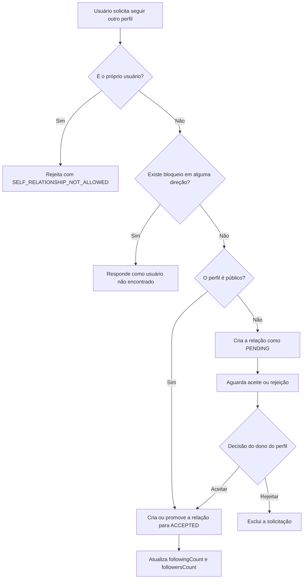
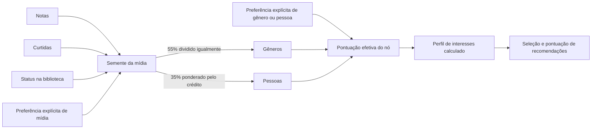

# Grafos de interesse e social

Este documento descreve como o Cabinet modela e usa o **grafo social** e o **grafo de interesses**. Apesar do nome em comum, eles têm ciclos de vida diferentes:

- o grafo social é persistido como relações entre usuários;
- o grafo de interesses é montado sob demanda, combinando preferências persistidas com sinais atuais de uso.

## Visão geral

| Grafo | Nós | Arestas ou sinais | Persistência | Uso principal |
| --- | --- | --- | --- | --- |
| Social | usuários | seguir, solicitação pendente e bloqueio | relações persistidas em `user_follows` e `user_blocks` | acesso a perfis e conteúdos, seguidores e seguindo |
| Interesses | gêneros, pessoas e mídias | preferências explícitas, notas, curtidas, biblioteca, créditos e relações entre mídias | somente preferências explícitas; o perfil calculado não é persistido | recomendações personalizadas |

## Grafo social

### Modelo de dados

O grafo social é direcionado. Se Alice segue Bruno, existe uma aresta de Alice para Bruno, sem que Bruno necessariamente siga Alice.

`UserFollow` usa a chave composta `(followerId, followedId)` e armazena:

- `status`: `PENDING` ou `ACCEPTED`;
- `requestedAt`: instante em que a solicitação foi criada;
- `acceptedAt`: instante em que ela foi aceita, quando aplicável.

Na API, esses estados aparecem como:

| Estado persistido | Estado público |
| --- | --- |
| relação inexistente | `NONE` |
| `PENDING` | `PENDING` |
| `ACCEPTED` | `FOLLOWING` |

`UserBlock` usa a chave composta `(blockerId, blockedId)` e registra `createdAt`. O bloqueio também é direcionado, mas, para as decisões de acesso, um bloqueio em qualquer direção separa os dois usuários.

Os totais `followersCount` e `followingCount` ficam desnormalizados em `User` e são atualizados quando uma relação entra ou sai do estado aceito.

### Fluxo de seguir



Detalhes importantes:

- perfis `PUBLIC` aceitam a relação imediatamente;
- perfis não públicos (`FOLLOWERS` ou `PRIVATE`) geram uma solicitação pendente;
- repetir a operação de seguir é idempotente: uma relação já existente não é duplicada;
- uma solicitação pendente é promovida automaticamente para aceita se o perfil tiver se tornado público;
- deixar de seguir, rejeitar uma solicitação ou remover um seguidor exclui a aresta;
- contadores só mudam para relações `ACCEPTED`, nunca para solicitações pendentes;
- seguir, aceitar, deixar de seguir, remover seguidor e bloquear exigem que as duas contas existam e estejam ativas.

As duas contas são bloqueadas para escrita em ordem determinística de UUID durante as transições. Isso reduz o risco de corrida e deadlock ao atualizar relações e contadores simultaneamente.

### Bloqueio

Ao bloquear outro usuário, o serviço executa a operação na mesma transação:

1. remove a relação de seguir nos dois sentidos, seja pendente ou aceita;
2. corrige os contadores caso alguma relação removida estivesse aceita;
3. cria a aresta de bloqueio, se ela ainda não existir;
4. exclui notificações existentes entre os dois usuários.

O bloqueio impede novas solicitações e faz com que perfis ou relações indisponíveis sejam apresentados como “não encontrados”, evitando revelar informações sobre a conta. Desbloquear apenas remove o bloqueio; relações de seguir anteriores não são restauradas.

### Visibilidade e autorização

`SocialAccessPolicy` centraliza as decisões de acesso.

Para perfis:

- o próprio dono sempre pode visualizar;
- um bloqueio em qualquer direção nega o acesso;
- um perfil `PUBLIC` pode ser visto por qualquer pessoa;
- um perfil não público só pode ser visto por um seguidor aceito.

Para conteúdos:

- o dono sempre pode visualizar;
- um bloqueio em qualquer direção nega o acesso;
- `PUBLIC` permite acesso;
- `PRIVATE` permite acesso apenas ao dono;
- `FOLLOWERS` exige que o visitante seja um seguidor aceito.

Essa política é reutilizada por perfis, listas, comentários e outros conteúdos com visibilidade.

### Listagens e paginação

Seguidores e usuários seguidos mostram apenas relações `ACCEPTED`. Solicitações recebidas e enviadas mostram apenas relações `PENDING`. Usuários bloqueados são listados separadamente.

As listas usam paginação por cursor, com ordenação decrescente por:

1. instante da relação (`acceptedAt`, `requestedAt` ou `createdAt`);
2. UUID do outro usuário, usado como desempate.

O cursor codifica esses dois valores e deve ser tratado pelo cliente como opaco. As consultas carregam `size + 1` registros para determinar `hasMore`. Nas listas públicas, usuários bloqueados pelo visitante ou que o bloquearam são omitidos.

### Endpoints principais

| Método e caminho | Função |
| --- | --- |
| `PUT /v1/me/following/{targetUserId}` | seguir ou solicitar acesso ao perfil |
| `DELETE /v1/me/following/{targetUserId}` | deixar de seguir ou cancelar solicitação |
| `GET /v1/users/{username}/followers` | listar seguidores aceitos |
| `GET /v1/users/{username}/following` | listar usuários seguidos |
| `GET /v1/me/follow-requests/incoming` | listar solicitações recebidas |
| `GET /v1/me/follow-requests/outgoing` | listar solicitações enviadas |
| `PUT /v1/me/follow-requests/{requesterId}/accept` | aceitar solicitação |
| `DELETE /v1/me/follow-requests/{requesterId}` | rejeitar solicitação |
| `DELETE /v1/me/followers/{followerId}` | remover um seguidor |
| `GET /v1/me/blocks` | listar bloqueios feitos pelo usuário |
| `PUT /v1/me/blocks/{targetUserId}` | bloquear usuário |
| `DELETE /v1/me/blocks/{targetUserId}` | desbloquear usuário |

## Grafo de interesses

### O que é persistido

`UserInterestPreference` guarda somente escolhas explícitas do usuário. Cada registro aponta para exatamente um destes tipos de alvo:

- `GENRE`: UUID canônico do gênero e rótulo de exibição;
- `PERSON`: uma pessoa do catálogo;
- `MEDIA`: uma mídia do catálogo.

A preferência é `POSITIVE` ou `NEGATIVE`. A combinação `(usuário, alvo lógico)` é única, portanto o `PUT` cria ou substitui a preferência existente.

Gêneros são identificados por UUID canônico, independentemente do idioma ou provedor. Nomes legados só são aceitos quando identificam um único gênero. Pessoas e mídias também são identificadas por UUID. Preferências de mídia aceitam apenas `MOVIE`, `SERIES`, `ALBUM` e `BOOK`.

O grafo completo não é salvo. `InterestGraphService.build(userId)` o reconstrói usando as preferências e o estado atual das avaliações, curtidas, biblioteca, gêneros e créditos.

### Sinais implícitos

Primeiro, cada interação produz um sinal para a mídia:

| Sinal | Pontuação |
| --- | ---: |
| nota | `(nota - 3) * 2` |
| curtida | `+2` |
| biblioteca `PLANNED` | `+0,5` |
| biblioteca `IN_PROGRESS` | `+1,5` |
| biblioteca `COMPLETED` | `+2` |
| biblioteca `PAUSED` | `0` |
| biblioteca `DROPPED` | `-2` |

Os sinais de uma mesma mídia são somados. A semente implícita resultante é limitada ao intervalo `[-6, +6]`.

Uma preferência explícita vale `+10` ou `-10`. Quando existe preferência explícita para uma mídia, ela substitui a semente implícita usada para propagar interesse dessa mídia aos gêneros e pessoas. Para qualquer nó, uma preferência explícita também substitui sua pontuação efetiva inferida.

### Propagação para gêneros e pessoas



Para cada mídia-semente suportada:

- 55% da pontuação é dividido igualmente entre seus gêneros únicos;
- 35% é dividido entre as pessoas creditadas, proporcionalmente ao peso de seus papéis;
- os 10% restantes não são propagados para esses dois grupos.

Pesos de crédito:

| Papel | Peso |
| --- | ---: |
| autor, criador, diretor ou artista | `1,0` |
| compositor ou roteirista | `0,75` |
| produtor | `0,5` |
| ator entre as 10 primeiras posições | `0,5` |
| demais atores | `0,2` |

Contribuições recebidas pelo mesmo gênero ou pessoa são somadas. A pontuação inferida final de cada nó é limitada a `[-8, +8]`.

Exemplo: uma mídia com nota 5, curtida e status `COMPLETED` soma `4 + 2 + 2 = 8`, mas sua semente é limitada a `6`. Se ela tiver dois gêneros, cada um recebe `6 * 0,55 / 2 = 0,825`. Os créditos, juntos, repartem `6 * 0,35 = 2,1` conforme o peso de cada papel.

### Resposta de interesses

Cada nó retornado contém:

- `polarity`: `POSITIVE` ou `NEGATIVE`, conforme o sinal da pontuação efetiva;
- `explicitPreference`: escolha explícita, ou `null` quando não existe;
- `inferred`: indica se o nó também recebeu sinal implícito;
- `strength`: força normalizada entre `0` e `1`, calculada como `min(1, abs(score) / 10)`.

Nós com pontuação efetiva praticamente zero não aparecem. A listagem é separada por `targetType` e ordenada primeiro pela maior força absoluta, depois pelo rótulo e pelo identificador.

Excluir uma preferência explícita não apaga sinais implícitos. Na próxima reconstrução, o nó pode continuar existindo com a pontuação inferida pelas interações do usuário.

### Como as recomendações são geradas

O serviço suporta recomendações de `MOVIE`, `SERIES`, `ALBUM` e `BOOK`.

1. Constrói o perfil de interesses atual.
2. Seleciona até 50 gêneros positivos e 50 pessoas positivas com maior pontuação.
3. Busca um conjunto de mídias candidatas que correspondam a esses gêneros ou pessoas.
4. Acrescenta mídias ligadas por `MediaRelation` a sementes de mídia positivas.
5. Exclui tudo com que o usuário já interagiu: itens avaliados, curtidos, presentes na biblioteca ou marcados explicitamente como interesse de mídia.
6. Pontua cada candidata somando contribuições de gêneros, pessoas e mídias relacionadas.
7. Descarta candidatas cuja soma seja menor ou igual a zero.
8. Ordena por pontuação, média pública de avaliações, quantidade de avaliações, título e UUID.
9. Completa espaços restantes com itens em alta nos últimos sete dias.

Na pontuação de uma candidata:

- a contribuição de gênero é dividida pela quantidade de gêneros da candidata;
- a contribuição de pessoas é distribuída conforme os mesmos pesos de crédito;
- uma relação com uma mídia-semente usa 50% da pontuação efetiva dessa semente;
- sinais negativos participam da soma e podem anular sinais positivos;
- até três contribuições positivas mais fortes são expostas como motivos.

Itens personalizados usam a origem `PERSONALIZED` e motivos `GENRE`, `PERSON` ou `MEDIA`. O preenchimento por popularidade usa a origem `TRENDING` e o motivo “Em alta no Cabinet”. Se não houver candidatos personalizados, toda a resposta pode vir desse fallback.

### Endpoints principais

| Método e caminho | Função |
| --- | --- |
| `GET /v1/me/interests?targetType=...` | listar o grafo calculado por tipo de alvo |
| `PUT /v1/me/interests` | criar ou substituir uma preferência explícita |
| `DELETE /v1/me/interests?targetType=...&targetId=...` | remover uma preferência explícita |
| `GET /v1/me/interests/options?targetType=...` | buscar alvos válidos para seleção |
| `GET /v1/me/recommendations` | obter recomendações personalizadas e/ou em alta |

Exemplo de preferência explícita:

```json
{
  "targetType": "GENRE",
  "targetId": "ficção científica",
  "preference": "POSITIVE"
}
```

## Relação entre os dois grafos

Atualmente, os grafos cumprem funções independentes:

- o grafo social controla relações, privacidade e acesso a conteúdo;
- o grafo de interesses representa afinidade com o catálogo e alimenta recomendações;
- seguir uma pessoa não adiciona peso ao perfil de interesses;
- as preferências ou recomendações não criam nem alteram relações sociais.

Ou seja, o sistema ainda não usa comportamento de amigos ou seguidores como sinal colaborativo de recomendação. A personalização é baseada exclusivamente nas ações e preferências do próprio usuário, enquanto o fallback usa o ranking global de itens em alta.

## Referências na implementação

- [`SocialGraphService.java`](../src/main/java/com/scriptles/cabinet/user/service/SocialGraphService.java): transições de seguir, solicitações e bloqueios;
- [`SocialAccessPolicy.java`](../src/main/java/com/scriptles/cabinet/user/service/SocialAccessPolicy.java): regras de visibilidade;
- [`InterestGraphService.java`](../src/main/java/com/scriptles/cabinet/user/service/InterestGraphService.java): construção do perfil de interesses;
- [`InterestScoringPolicy.java`](../src/main/java/com/scriptles/cabinet/user/service/InterestScoringPolicy.java): pesos, limites e normalização;
- [`RecommendationService.java`](../src/main/java/com/scriptles/cabinet/user/service/RecommendationService.java): seleção e pontuação das recomendações.
