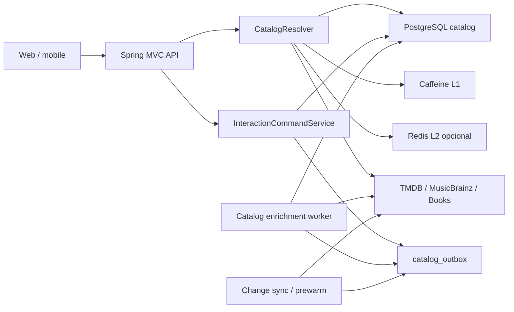
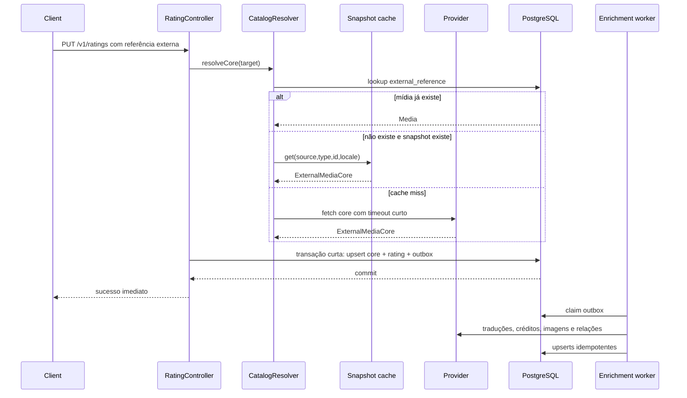

# Plano de arquitetura — catálogo, importação e interação de mídia

**Repositório:** `cabinet.backend`  
**Escopo:** performance, UX, catálogo local, importação progressiva, sincronização externa e suporte a português/inglês  
**Status:** proposta de implementação

> Este documento descreve uma arquitetura recomendada para uma plataforma de catálogo social da categoria do Letterboxd. Ele não pressupõe conhecer a implementação interna do Letterboxd; usa padrões comuns de sistemas de catálogo de grande escala, adaptados ao Cabinet e ao seu estágio atual.

---

## 1. Resumo executivo

Hoje, uma mídia externa é materializada no banco apenas quando o usuário interage com ela. O fluxo atual executa trabalho demais antes de concluir a ação:

- consulta o provedor externo;
- consulta o Wikidata;
- persiste a mídia e detalhes específicos;
- persiste temporadas ou faixas;
- resolve pessoas;
- persiste créditos;
- tenta reconciliar identidades;
- pode executar diversas chamadas externas por pessoa;
- só depois permite que avaliação, like, lista ou status do usuário sejam concluídos.

Essa estratégia gera uma dependência direta entre a UX da interação e a velocidade de TMDB, Wikidata, MusicBrainz, Google Books, rede e banco de dados.

A arquitetura recomendada é:

1. **Manter um catálogo local próprio**, identificado por UUID interno e referências externas únicas.
2. **Materializar somente o núcleo da mídia no caminho crítico**.
3. **Registrar a interação na mesma operação lógica**, sem obrigar o frontend a chamar `/import` antes.
4. **Mover créditos, identidades, traduções secundárias, relações e metadados adicionais para uma pipeline assíncrona durável**.
5. **Reutilizar o snapshot externo já buscado na página de detalhes**, evitando consultar o provedor novamente na interação.
6. **Tratar idiomas como dados de catálogo**, com traduções independentes para `pt-BR` e `en-US`.
7. **Evoluir de importação sob demanda para ingestão híbrida**, pré-aquecendo títulos populares e sincronizando alterações.

Resultado esperado:

```text
Usuário clica em avaliar
        ↓
Cabinet encontra ou cria o núcleo local
        ↓
Cabinet salva a avaliação
        ↓
Resposta imediata ao usuário
        ↓
Outbox durável
        ↓
Worker completa créditos, traduções, artwork e relações
```

---

## 2. Diagnóstico do estado atual

### 2.1 Importação dentro de uma transação longa

`ExternalMediaService.importMedia()` está anotado com `@Transactional` e chama provedores externos antes de persistir os dados.

Isso mantém uma transação aberta enquanto a aplicação espera rede. O read timeout configurado para APIs externas chega a 10 segundos. Mesmo que o Hibernate só adquira a conexão posteriormente em alguns cenários, a fronteira transacional continua grande, dificulta retries e aumenta o risco de:

- consumir conexões do pool por muito tempo;
- aumentar contenção;
- gerar rollback depois de trabalho externo caro;
- repetir chamadas em caso de falha;
- misturar falhas de rede com consistência de banco.

**Regra proposta:** nenhuma chamada externa deve ocorrer dentro de uma transação de escrita.

### 2.2 Importação completa no caminho crítico

O fluxo atual salva:

- `Media`;
- detalhes por tipo;
- temporadas de série;
- faixas de álbum;
- créditos;
- pessoas;
- referências externas da mídia;
- referência do Wikidata.

Para filmes e séries, o cliente TMDB usa `append_to_response=credits,images`. Portanto, o fluxo recebe e processa elenco, equipe e imagens na mesma operação que deveria apenas permitir a interação.

### 2.3 Resolução de pessoas é muito cara

`MediaCreditService.save()` percorre os créditos e chama `PersonIdentityService.resolve()` para cada pessoa.

Até 12 pessoas por importação podem ser enriquecidas com uma chamada adicional para descobrir o ID do Wikidata. A resolução de identidade ainda pode:

- buscar referências externas;
- buscar pessoas pelo nome;
- salvar pessoa;
- salvar referência;
- verificar candidatos homônimos;
- consultar Wikidata para candidatos;
- fazer merge de pessoas;
- mover créditos;
- executar múltiplos `flush()`.

Esse trabalho é útil para qualidade editorial, mas não é necessário para que o usuário avalie ou marque uma obra como assistida.

### 2.4 Reimportação de mídia existente ainda pode ser pesada

Quando a referência externa já existe, o fluxo chama `storedCreatorOrBackfill()`. Em alguns casos ele executa reconciliação de créditos e resolução de pessoas novamente.

Uma interação em uma mídia já importada deve ser essencialmente uma leitura por referência externa e uma escrita da ação do usuário. Reconciliação não deve ocorrer nessa rota.

### 2.5 Duas viagens obrigatórias pelo frontend

O frontend tende a executar:

```text
POST /v1/media/external/import
aguardar
POST /v1/media/{id}/ratings
aguardar
```

Além de duplicar latência de rede, isso expõe ao cliente uma responsabilidade interna do catálogo. O usuário quer avaliar, curtir ou adicionar à lista; ele não deveria perceber uma etapa de importação.

### 2.6 O modelo atual guarda apenas um idioma

`Media` contém diretamente:

- `title`;
- `description`;
- `tagline`;
- nomes de gêneros como strings.

A importação usa `pt-BR` de forma fixa. Isso impede:

- apresentar a mesma mídia corretamente em português e inglês;
- cachear detalhes por locale;
- pesquisar pelos dois títulos;
- sincronizar uma tradução sem sobrescrever a outra;
- diferenciar título original de tradução;
- controlar fallback.

O request de importação também não carrega locale.

### 2.7 Cache externo apenas em memória e parcial

A resolução de identidade mantém um `ConcurrentHashMap` em processo e só armazena resultados positivos. Isso significa:

- cache perdido em restart;
- caches diferentes entre réplicas;
- resultados negativos consultados repetidamente;
- ausência de TTL;
- crescimento sem política explícita de expiração.

---

## 3. Objetivos e metas

### 3.1 Objetivos de produto

- A ação do usuário deve parecer instantânea.
- Falha de enriquecimento não pode apagar ou bloquear uma avaliação.
- Uma mídia deve possuir identidade única independentemente do idioma.
- O Cabinet deve continuar funcional durante indisponibilidade parcial de provedores.
- A página deve renderizar conteúdo principal antes de dados secundários.
- Português e inglês devem ser suportados sem duplicar mídias.

### 3.2 SLOs iniciais

Após aquecimento:

| Operação | p50 | p95 | p99 |
| --- | ---: | ---: | ---: |
| Interação em mídia já local | <= 80 ms | <= 200 ms | <= 400 ms |
| Primeira interação com snapshot em cache | <= 150 ms | <= 350 ms | <= 700 ms |
| Primeira interação com fetch externo | <= 500 ms | <= 1,5 s | <= 2,5 s |
| Detalhes públicos locais com cache | <= 50 ms | <= 100 ms | <= 200 ms |
| Estado pessoal | <= 100 ms | <= 250 ms | <= 500 ms |

A meta principal não é garantir que todo enriquecimento termine rapidamente. É garantir que o caminho crítico tenha orçamento e degradação controlados.

### 3.3 Orçamento do caminho crítico

```text
Autenticação e validação             20–50 ms
Lookup local/referência              10–40 ms
Snapshot cache                       5–30 ms
Upsert de núcleo + interação         30–120 ms
Serialização e rede                  20–100 ms
```

Quando houver cache miss externo, deve existir um orçamento rígido de rede. O usuário não deve esperar 10 segundos.

---

## 4. Princípios arquiteturais

1. **Local-first:** o banco do Cabinet é a fonte operacional para páginas e interações.
2. **External IDs are references:** TMDB, MusicBrainz, Google Books e Wikidata não são chaves primárias.
3. **Core before enrichment:** título, tipo, data e artwork básico primeiro; créditos e relações depois.
4. **No external I/O in write transactions.**
5. **Idempotency by design:** qualquer job pode ser reexecutado.
6. **Interaction is the product action:** importação é um detalhe interno.
7. **Progressive disclosure:** a página não espera dados comunitários, pessoais ou editoriais secundários.
8. **Locale is part of the representation, not identity.**
9. **Failures are isolated by component:** falha de Wikidata não deve falhar TMDB, rating ou tradução.
10. **Start simple, preserve the path to scale:** PostgreSQL pode ser a fila durável inicial.

---

## 5. Arquitetura alvo



### 5.1 Componentes recomendados

```text
media/
├── catalog/
│   ├── CatalogResolver.java
│   ├── CatalogMaterializationService.java
│   ├── CatalogSnapshotCache.java
│   ├── CatalogLocaleResolver.java
│   └── CatalogStatus.java
├── command/
│   ├── RatingCommandService.java
│   ├── LikeCommandService.java
│   ├── ListItemCommandService.java
│   └── UserMediaCommandService.java
├── enrichment/
│   ├── CatalogOutboxPublisher.java
│   ├── CatalogOutboxWorker.java
│   ├── MediaTranslationEnricher.java
│   ├── MediaCreditEnricher.java
│   ├── MediaArtworkEnricher.java
│   ├── MediaRelationEnricher.java
│   └── PersonIdentityEnricher.java
├── sync/
│   ├── TmdbChangeSyncScheduler.java
│   ├── CatalogRefreshScheduler.java
│   └── PopularMediaPrewarmScheduler.java
└── query/
    ├── PublicMediaQueryService.java
    ├── MediaCommunityQueryService.java
    └── UserMediaStateQueryService.java
```

---

## 6. Novo fluxo de interação

### 6.1 Contrato de referência de mídia

Toda mutação deve aceitar uma referência que possa ser local ou externa.

```java
public record MediaTarget(
        UUID mediaId,
        ExternalSource source,
        String externalId,
        MediaType mediaType,
        String locale
) {}
```

Validação:

- `mediaId` ou trio `source + externalId + mediaType`;
- nunca exigir ambos;
- normalizar locale para um conjunto suportado.

### 6.2 Exemplo de avaliação

```http
PUT /v1/ratings
Content-Type: application/json

{
  "media": {
    "source": "TMDB",
    "externalId": "550",
    "mediaType": "MOVIE",
    "locale": "pt-BR"
  },
  "rating": 4.5
}
```

Resposta:

```json
{
  "mediaId": "uuid-interno",
  "rating": 4.5,
  "catalogStatus": "CORE_READY",
  "enrichmentPending": true
}
```

Quando a mídia já for local:

```json
{
  "media": {
    "mediaId": "uuid-interno"
  },
  "rating": 4.5
}
```

### 6.3 Sequência



### 6.4 Fronteira transacional correta

O orquestrador não deve ser transacional:

```java
@Service
@RequiredArgsConstructor
public class RatingInteractionFacade {

    private final CatalogResolver catalogResolver;
    private final RatingInteractionWriter writer;

    public RatingResponse upsert(UUID userId, MediaTarget target, BigDecimal rating) {
        CatalogCoreSnapshot snapshot = catalogResolver.resolve(target);
        return writer.upsert(userId, target, snapshot, rating);
    }
}
```

A escrita deve ser curta:

```java
@Service
@RequiredArgsConstructor
public class RatingInteractionWriter {

    @Transactional
    public RatingResponse upsert(
            UUID userId,
            MediaTarget target,
            CatalogCoreSnapshot snapshot,
            BigDecimal rating
    ) {
        Media media = catalogMaterializationService.findOrCreateCore(target, snapshot);
        Rating saved = ratingService.upsertResolved(userId, media, rating);
        outboxPublisher.publishMediaCoreReady(media.getId());
        return new RatingResponse(media.getId(), saved.getValue(), media.getCatalogStatus(), true);
    }
}
```

Importante: separar em beans diferentes para que o proxy transacional seja aplicado corretamente.

---

## 7. Reutilização do snapshot da página de detalhes

Quando o usuário abre uma mídia externa, o backend já consultou o provedor. A interação seguinte não deve repetir a mesma consulta.

### 7.1 Snapshot cache

Chave:

```text
external-media:{source}:{type}:{externalId}:{locale}
```

Conteúdo:

```java
public record CatalogCoreSnapshot(
        ExternalSource source,
        String externalId,
        MediaType type,
        String originalTitle,
        String originalLanguage,
        LocalDate releaseDate,
        String countryCode,
        LocalizedMediaSnapshot localized,
        ArtworkSnapshot artwork,
        Instant fetchedAt
) {}
```

TTL recomendado:

| Cache | TTL |
| --- | --- |
| Resultado de busca externa | 5–15 min |
| Detalhe externo/core | 15–60 min |
| Resultado negativo | 30 s–5 min |
| Referência externa → UUID | 1–24 h |
| Detalhe público local | 30 min–6 h |
| Comunidade | 30 s–5 min |

### 7.2 L1 e L2

Fase inicial:

- Caffeine como L1;
- tamanho limitado;
- TTL;
- métricas de hit/miss.

Quando houver múltiplas réplicas:

- Redis como L2;
- Caffeine continua como L1;
- cache keys versionadas;
- invalidação por evento.

### 7.3 Token opcional

Uma evolução possível é retornar um token HMAC curto junto ao detalhe externo:

```json
{
  "externalId": "550",
  "source": "TMDB",
  "mediaType": "MOVIE",
  "catalogToken": "opaque-signed-token"
}
```

O token pode provar que o Cabinet buscou aquele registro recentemente. Não é obrigatório no início; Redis ou Caffeine já resolvem a maior parte do problema.

Não confiar em título, data ou artwork enviados livremente pelo frontend como dados autoritativos.

---

## 8. Materialização progressiva

### 8.1 Estados

Adicionar um estado de catálogo:

```java
public enum CatalogStatus {
    CORE_READY,
    ENRICHING,
    READY,
    STALE,
    FAILED
}
```

Campos sugeridos em `media`:

```text
catalog_status
core_synced_at
enrichment_synced_at
sync_version
last_sync_error
```

`last_sync_error` pode ficar em uma tabela operacional para evitar poluir a entidade principal.

### 8.2 O que entra no núcleo

Obrigatório para concluir a interação:

- tipo;
- referência externa principal;
- título original ou melhor título disponível;
- idioma original;
- data de lançamento;
- country code;
- poster básico;
- UUID interno;
- detalhes mínimos usados por regras de negócio.

Por tipo:

**Filme**
- runtime pode ser incluído, mas não deve bloquear se ausente.

**Série**
- primeira data de exibição;
- status básico, se disponível;
- não importar temporadas completas no caminho crítico.

**Álbum**
- artista principal;
- data;
- não materializar todas as faixas no caminho crítico.

**Livro**
- título;
- autores principais;
- data;
- ISBN quando disponível.

### 8.3 O que fica assíncrono

- créditos completos;
- enriquecimento de pessoa;
- Wikidata;
- imagens adicionais e logos;
- relações;
- temporadas;
- episódios;
- tracklist completa;
- referências secundárias;
- awards;
- disponibilidade;
- métricas externas;
- segunda tradução;
- reconciliação editorial.

---

## 9. Pipeline assíncrona durável

### 9.1 Não usar somente `@Async`

`@Async` é útil para trabalho descartável, mas não deve ser a única garantia de uma importação:

- reinício perde tarefas;
- deploy interrompe processamento;
- várias réplicas podem duplicar trabalho;
- não existe retry durável;
- não existe dead-letter explícita.

### 9.2 Outbox no PostgreSQL

Como o projeto já é um monólito modular e PostgreSQL é a dependência durável principal, a melhor primeira solução é uma outbox no banco.

Tabela:

```sql
CREATE TABLE catalog_outbox (
    id UUID PRIMARY KEY,
    aggregate_id UUID NOT NULL,
    event_type VARCHAR(80) NOT NULL,
    payload JSONB NOT NULL,
    status VARCHAR(20) NOT NULL,
    attempts INTEGER NOT NULL DEFAULT 0,
    available_at TIMESTAMPTZ NOT NULL,
    locked_at TIMESTAMPTZ,
    locked_by VARCHAR(120),
    last_error TEXT,
    created_at TIMESTAMPTZ NOT NULL,
    processed_at TIMESTAMPTZ
);

CREATE INDEX idx_catalog_outbox_claim
    ON catalog_outbox (status, available_at, created_at);
```

Claim concorrente:

```sql
SELECT id
FROM catalog_outbox
WHERE status IN ('PENDING', 'RETRY')
  AND available_at <= now()
ORDER BY created_at
FOR UPDATE SKIP LOCKED
LIMIT 50;
```

### 9.3 Tipos de evento

```text
MEDIA_CORE_MATERIALIZED
MEDIA_TRANSLATION_REQUESTED
MEDIA_CREDITS_REQUESTED
MEDIA_ARTWORK_REQUESTED
MEDIA_RELATIONS_REQUESTED
MEDIA_REFRESH_REQUESTED
PERSON_IDENTITY_REQUESTED
```

Um evento inicial pode gerar jobs menores. Isso permite retry independente.

### 9.4 Retry

Estratégia:

```text
1ª falha: 30 s
2ª falha: 2 min
3ª falha: 10 min
4ª falha: 1 h
5ª falha: 6 h
Depois: DEAD
```

Regras:

- `429`: respeitar `Retry-After` quando disponível;
- timeout: retry com jitter;
- `404`: marcar componente como indisponível e não repetir agressivamente;
- erro de validação: dead-letter;
- erro de banco transitório: retry;
- falha de Wikidata não altera status do core.

### 9.5 Idempotência

Cada handler deve usar upsert por chave natural:

```text
media_translation: unique(media_id, locale)
external_reference: unique(source, external_id)
media_credit: unique(media_id, person_id, role, character_normalized)
person_external_reference: unique(source, external_id)
series_season: unique(series_id, season_number)
album_track: unique(album_id, disc_number, track_number)
```

Pode haver uma chave de deduplicação de job:

```text
unique(event_type, aggregate_id, payload_hash, active_status)
```

---

## 10. Estratégia de idiomas

## 10.1 Decisão central

Não criar uma mídia para português e outra para inglês.

```text
Media = identidade canônica
MediaTranslation = representação localizada
```

### 10.2 Locales suportados

Inicialmente:

```java
public enum SupportedLocale {
    PT_BR("pt-BR"),
    EN_US("en-US");
}
```

Evitar aceitar strings arbitrárias dentro do domínio. O adapter do provedor pode converter o locale do Cabinet para o formato específico do provedor.

### 10.3 Modelo de dados

#### `media`

Deve guardar dados independentes de tradução:

```text
id
type
original_title
original_language
release_date
country_code
catalog_status
core_synced_at
created_at
updated_at
version
```

O campo `title` atual pode ser mantido temporariamente como título de fallback durante a migração, mas não deve continuar sendo a única fonte de título.

#### `media_translation`

```sql
CREATE TABLE media_translation (
    id UUID PRIMARY KEY,
    media_id UUID NOT NULL REFERENCES media(id) ON DELETE CASCADE,
    locale VARCHAR(10) NOT NULL,
    title VARCHAR(300) NOT NULL,
    description TEXT,
    tagline VARCHAR(500),
    source VARCHAR(30) NOT NULL,
    source_language VARCHAR(10),
    translation_status VARCHAR(20) NOT NULL,
    last_synced_at TIMESTAMPTZ,
    created_at TIMESTAMPTZ NOT NULL,
    updated_at TIMESTAMPTZ NOT NULL,
    UNIQUE (media_id, locale)
);
```

Status:

```text
AVAILABLE
PARTIAL
FALLBACK
MISSING
STALE
```

### 10.4 Artwork localizado

Pôsteres e logos podem ter idioma. Não guardar apenas uma URL canônica se a UX depende do locale.

```sql
CREATE TABLE media_artwork (
    id UUID PRIMARY KEY,
    media_id UUID NOT NULL REFERENCES media(id) ON DELETE CASCADE,
    kind VARCHAR(20) NOT NULL,
    locale VARCHAR(10),
    url TEXT NOT NULL,
    provider VARCHAR(30) NOT NULL,
    provider_path TEXT,
    width INTEGER,
    height INTEGER,
    score NUMERIC,
    is_primary BOOLEAN NOT NULL DEFAULT FALSE,
    last_synced_at TIMESTAMPTZ,
    UNIQUE (media_id, kind, locale, provider, provider_path)
);
```

`locale = NULL` representa imagem sem idioma.

Fallback de artwork:

```text
locale exato
→ imagem sem idioma
→ en-US
→ artwork canônico legado
```

Para `pt-BR`, uma capa em português deve ser preferida; se não existir, uma imagem sem texto pode ser melhor que uma capa em inglês. O ranking deve ser configurável por tipo de artwork.

### 10.5 Gêneros

A migração `V53` separou a identidade das traduções. `media_genres` permanece como compatibilidade temporária.

Modelo implementado:

```text
genre
- id
- canonical_key
- provisional

genre_translation
- genre_id
- locale
- name

genre_external_ref
- genre_id
- source
- external_id

genre_alias
- locale
- normalized_name
- genre_id

media_genre
- media_id
- genre_id
```

Isso permite que o mesmo gênero seja “Drama” nos dois idiomas, “Science Fiction” em inglês e “Ficção científica” em português.

Busca, filtros, interesses e recomendações usam o UUID canônico; uma fusão revisada pode consolidar gêneros provisórios.

### 10.6 Pessoas

Nomes de pessoas normalmente não devem ser traduzidos. Biografia, local de nascimento e descrições podem ser localizados futuramente.

Modelo futuro:

```text
person
person_translation
```

Não bloquear o projeto atual por isso.

### 10.7 Resolução do locale

Precedência:

1. parâmetro explícito validado;
2. preferência salva do usuário;
3. locale da rota/app;
4. `Accept-Language`;
5. `pt-BR` como padrão inicial do Cabinet.

O backend deve responder:

```http
Content-Language: pt-BR
Vary: Accept-Language
```

Para APIs internas cacheadas por query, usar explicitamente:

```http
GET /v1/media/{id}?locale=pt-BR
```

Isso simplifica cache de CDN e observabilidade.

### 10.8 Fallback de texto

Para usuário em `pt-BR`:

```text
pt-BR
→ en-US
→ idioma original, se armazenado
→ original_title
→ título legado
```

Para usuário em `en-US`:

```text
en-US
→ idioma original, se inglês
→ tradução disponível mais confiável
→ original_title
→ título legado
```

A resposta deve indicar o idioma efetivamente usado:

```json
{
  "requestedLocale": "pt-BR",
  "resolvedLocale": "en-US",
  "translationFallback": true
}
```

O frontend não precisa exibir essa informação ao usuário, mas ela é importante para debug e qualidade.

### 10.9 Sincronização de traduções

Na primeira interação:

1. materializar a tradução solicitada;
2. registrar a interação;
3. enfileirar a segunda tradução suportada;
4. atualizar caches quando ela chegar.

Como o Cabinet terá apenas `pt-BR` e `en-US`, manter as duas traduções para mídias ativas é barato e melhora busca, SEO e compartilhamento.

### 10.10 TMDB

O TMDB aceita locale em formato semelhante a `pt-BR` e `en-US`. O adapter deve ter métodos separados:

```java
findCoreById(type, id, locale)
findLocalizedDetails(type, id, locale)
findCredits(type, id)
findImages(type, id, imageLanguages)
```

Evitar que a busca de uma tradução repita créditos, pois créditos não mudam por locale.

### 10.11 Cache por idioma

Nunca usar:

```text
mediaDetails:{mediaId}
```

Usar:

```text
mediaDetails:{mediaId}:{locale}
externalSnapshot:{source}:{type}:{externalId}:{locale}
search:{locale}:{normalizedQuery}:{filters}
```

Dados não localizados, como referências externas, podem ter cache independente.

### 10.12 Busca bilíngue

Para o MVP, PostgreSQL é suficiente.

Extensões:

```sql
CREATE EXTENSION IF NOT EXISTS unaccent;
CREATE EXTENSION IF NOT EXISTS pg_trgm;
```

Índice:

```sql
CREATE INDEX idx_media_translation_title_trgm
ON media_translation
USING gin (lower(unaccent(title)) gin_trgm_ops);
```

Busca:

- procurar primeiro no locale solicitado;
- permitir match em qualquer tradução;
- dar boost para o locale solicitado;
- permitir match no `original_title`;
- retornar a representação no locale do usuário.

Exemplo: um usuário em inglês pode buscar “City of God”; um usuário em português pode buscar “Cidade de Deus”. Ambos resolvem para o mesmo UUID.

Em escala maior, migrar a indexação para OpenSearch/Elasticsearch sem alterar o modelo canônico.

---

## 11. Mudanças no cliente TMDB

### 11.1 Separar core e full

Hoje `findById(..., detailed=true)` inclui `credits,images`.

Criar:

```java
Optional<ExternalMediaCore> findCoreById(
        MediaType type,
        String externalId,
        String locale
);

Optional<ExternalMediaEnrichment> findEnrichmentById(
        MediaType type,
        String externalId,
        String locale
);
```

Core:

- detalhes principais;
- poster e backdrop já presentes no objeto principal;
- genres;
- runtime/status básicos;
- sem créditos completos;
- sem consulta ao Wikidata;
- sem imagens adicionais.

Enrichment:

- credits;
- images;
- external IDs;
- traduções adicionais;
- temporadas ou outros componentes.

### 11.2 Timeouts por classe de operação

Não usar um único read timeout para tudo.

| Operação | Timeout sugerido |
| --- | --- |
| Busca | 1,5–3 s |
| Core usado em interação | 1,5–2,5 s |
| Detalhe de página | 2–4 s |
| Enriquecimento em worker | 5–10 s |
| Wikidata | 3–8 s em worker |

Configurar clientes ou factories separados.

### 11.3 Resiliência

Adicionar:

- circuit breaker;
- retry apenas para falhas transitórias;
- rate limiter;
- bulkhead por provedor;
- jitter;
- métricas por endpoint externo.

Resilience4j é adequado para o monólito atual. Não executar retry de longa duração no thread HTTP.

### 11.4 Cache negativo

Guardar “não encontrado” por TTL curto evita tempestade de requests para IDs removidos ou dados incompletos.

### 11.5 Cache de identidade

Substituir o `ConcurrentHashMap` sem TTL por cache limitado:

```text
personIdentity:{source}:{externalId}
```

Guardar:

- sucesso por horas ou dias;
- ausência por minutos;
- erro não deve virar ausência permanente.

Em múltiplas réplicas, usar Redis ou persistência em `person_external_reference`.

---

## 12. Concorrência e single-flight

### 12.1 Constraint obrigatória

```sql
CREATE UNIQUE INDEX uk_external_reference_source_external_id
ON external_reference(source, external_id);
```

A identidade externa deve ser independente de locale.

### 12.2 Corrida de primeira importação

Dois usuários podem interagir com o mesmo filme simultaneamente.

Estratégia:

1. consultar referência;
2. tentar inserir;
3. em conflito, reler a referência vencedora;
4. continuar a interação.

Não usar lock global.

### 12.3 Single-flight

Dentro de uma instância:

```text
ConcurrentMap<ExternalMediaKey, CompletableFuture<CatalogCoreSnapshot>>
```

Assim, dez requests para o mesmo filme compartilham um fetch externo.

Em múltiplas instâncias:

- Redis lock curto opcional;
- ou aceitar fetch duplicado e depender da constraint;
- nunca depender do lock para consistência.

### 12.4 Idempotency-Key

Para mutações do frontend:

```http
Idempotency-Key: uuid-gerado-no-cliente
```

Tabela opcional:

```text
api_idempotency
- key
- user_id
- operation
- response
- status
- expires_at
```

Isso evita avaliações duplicadas em retry de rede, embora upsert já reduza o risco.

---

## 13. Estratégia de catálogo em escala

A melhor arquitetura de longo prazo não depende da primeira interação para descobrir toda mídia.

### 13.1 Estágio 1 — read-through catalog

Adequado agora:

- pesquisar localmente;
- complementar com provedor;
- materializar sob demanda;
- enriquecer depois;
- cachear snapshots.

### 13.2 Estágio 2 — prewarm orientado a demanda

Importar antecipadamente:

- títulos em alta;
- lançamentos;
- mídias presentes em listas públicas;
- mídias com muitas visualizações externas;
- itens retornados frequentemente em busca;
- franquias relacionadas a itens populares.

Rodar em baixa prioridade.

### 13.3 Estágio 3 — índice de IDs e mudanças

O TMDB publica exports diários de IDs válidos e endpoints de changes. Eles não são um dump completo de metadados, mas podem alimentar:

- índice leve de IDs;
- remoções;
- seleção por popularidade;
- fila de hidratação;
- atualização de mídias já importadas.

Estratégia:

```text
Daily ID export
    ↓
external_catalog_index
    ↓
seleção de popularidade/relevância
    ↓
jobs de core materialization
```

Changes:

```text
TMDB changed IDs
    ↓
intersectar com mídias importadas
    ↓
MEDIA_REFRESH_REQUESTED
    ↓
sincronizar traduções e dados alterados
```

Não consultar detalhes completos de todos os IDs sem necessidade.

### 13.4 Estágio 4 — catálogo independente

Quando o volume justificar:

- worker separado;
- Redis;
- fila gerenciada;
- busca dedicada;
- CDN de imagens;
- data warehouse;
- pipelines de qualidade editorial.

A API de produto continua usando o mesmo UUID interno e não precisa mudar.

---

## 14. UX do frontend

### 14.1 Otimismo controlado

Ao avaliar:

1. atualizar estrelas imediatamente;
2. enviar request;
3. manter estado “salvando” discreto;
4. confirmar;
5. em falha, reverter e informar.

Não bloquear a página com overlay global.

### 14.2 Página externa progressiva

Renderizar nesta ordem:

1. shell da rota;
2. dados do card clicado: título, ano, capa;
3. core do detalhe;
4. estado pessoal;
5. comunidade;
6. créditos;
7. relações;
8. disponibilidade e dados externos.

A página não deve parecer congelada na tela anterior. O frontend deve mudar de rota e mostrar o layout de destino imediatamente.

### 14.3 Prefetch

Ao receber intenção forte:

- hover/focus em desktop;
- item entrando próximo ao viewport;
- toque inicial quando aplicável;
- links do Next.js com prefetch controlado.

Prefetch do core deve preencher o snapshot cache do backend ou o cache do Next.js.

### 14.4 Estado de enriquecimento

O usuário não precisa ver “importando banco”. A interface pode simplesmente:

- exibir o que já existe;
- usar skeleton em créditos/relações;
- atualizar quando disponível;
- não esconder a avaliação salva.

### 14.5 Erro externo durante primeira interação

Fallbacks possíveis:

**Snapshot disponível**
- salvar normalmente.

**Sem snapshot e provedor lento**
- tentar core com timeout curto;
- se não for possível validar a mídia, retornar erro específico e manter estado otimista reversível.

Evolução futura:
- aceitar a interação como `PENDING_RESOLUTION` usando referência externa e processar depois. Isso exige mais complexidade e só deve ser usado se o produto realmente precisar aceitar ações offline/sem provedor.

---

## 15. APIs de leitura

Separar:

```http
GET /v1/media/{id}?locale=pt-BR
GET /v1/media/{id}/community
GET /v1/media/{id}/me
GET /v1/media/{id}/credits?locale=pt-BR
GET /v1/media/{id}/relations?locale=pt-BR
```

Detalhes públicos:

- cache compartilhável;
- locale explícito;
- sem usuário;
- sem métricas pesadas;
- sem progresso pessoal.

Headers:

```http
Cache-Control: public, max-age=60, s-maxage=3600, stale-while-revalidate=86400
Content-Language: pt-BR
ETag: "media-version-locale"
```

Estado pessoal:

```http
Cache-Control: private, no-store
```

---

## 16. Observabilidade

O Actuator já está declarado no projeto. Adicionar métricas Micrometer.

### 16.1 Timers

```text
cabinet.catalog.resolve
cabinet.catalog.materialize.core
cabinet.catalog.interaction
cabinet.catalog.enrichment
cabinet.provider.request
cabinet.media.translation.resolve
```

Tags controladas:

```text
provider
media_type
locale
cache_result
catalog_status
operation
outcome
```

Não usar `externalId` como tag por cardinalidade.

### 16.2 Contadores

```text
catalog.snapshot.cache.hit
catalog.snapshot.cache.miss
catalog.materialization.created
catalog.materialization.race_won
catalog.materialization.race_lost
catalog.outbox.pending
catalog.outbox.retry
catalog.outbox.dead
catalog.translation.fallback
provider.rate_limited
provider.timeout
```

### 16.3 Distribuições

- latência p50/p95/p99;
- queries SQL por request;
- tamanho do payload;
- créditos processados;
- jobs por mídia;
- idade do job mais antigo;
- tempo entre `CORE_READY` e `READY`.

### 16.4 Tracing

Criar um correlation ID por request e propagar para outbox:

```text
request_id
user_id, apenas em logs protegidos
media_id
external_source
external_id
outbox_event_id
```

### 16.5 Alertas

- p95 de interação acima de 500 ms;
- taxa de timeout externa;
- pool Hikari acima de 80%;
- outbox atrasada;
- dead-letter crescente;
- fallback de tradução acima de limiar;
- erros por provider.

---

## 17. Migrações sugeridas

Ordem:

1. unique constraint de referências externas;
2. campos de status/sync em `media`;
3. `media_translation`;
4. `media_artwork`;
5. normalização de gênero;
6. `catalog_outbox`;
7. índices de busca;
8. backfill de dados existentes.

### 17.1 Backfill de idioma

Para mídias existentes:

- se o registro foi importado com o fluxo atual, assumir `pt-BR` como locale inicial;
- criar `media_translation` com `title`, `description`, `tagline`;
- manter `original_title` em `media`;
- marcar tradução como `AVAILABLE` ou `PARTIAL`;
- enfileirar `en-US`;
- não apagar colunas legadas na primeira versão.

### 17.2 Migração em duas leituras

Fase de compatibilidade:

```text
ler media_translation
→ se ausente, usar media.title/description/tagline
```

Depois do backfill e estabilização:

- tornar a nova leitura padrão;
- remover escrita nas colunas legadas;
- remover colunas em migração posterior.

---

## 18. Plano de implementação

## Fase 0 — baseline e proteção

**Objetivo:** medir antes de alterar.

- adicionar timers no import atual;
- contar queries;
- medir número de créditos;
- medir chamadas TMDB/Wikidata por import;
- medir p50/p95/p99;
- adicionar log estruturado de import;
- criar teste de performance para filme popular com elenco grande;
- confirmar unique constraint em `external_reference`.

**Aceite:**

- dashboard ou endpoint de métricas mostra latência por etapa;
- existe um baseline reproduzível.

## Fase 1 — quick wins

**Objetivo:** remover trabalho claramente indevido.

- remover `reconcile()` do retorno de mídia existente;
- não fazer backfill de créditos em toda interação;
- criar método de leitura simples do creator;
- separar fetch externo da transação;
- reduzir timeout do caminho crítico;
- adicionar cache com TTL e limite ao snapshot externo;
- cachear resultados negativos;
- manter endpoint `/import` para compatibilidade.

**Aceite:**

- mídia existente não chama provedor;
- mídia existente não reconcilia pessoas;
- nenhuma chamada externa ocorre dentro de transação de escrita.

## Fase 2 — interação com referência externa

**Objetivo:** eliminar a chamada `/import` do fluxo do usuário.

- criar `MediaTarget`;
- criar `CatalogResolver`;
- criar `CatalogMaterializationService`;
- adicionar overloads de rating, like, lista e status;
- materializar core e salvar interação em transação curta;
- retornar UUID interno;
- manter contratos antigos durante migração do frontend.

**Aceite:**

- primeira avaliação exige uma única request;
- retry concorrente cria uma mídia;
- interação permanece salva mesmo se enriquecimento falhar.

## Fase 3 — outbox e enrichment

**Objetivo:** tornar trabalho secundário durável.

- criar `catalog_outbox`;
- worker com `SKIP LOCKED`;
- retry/backoff;
- handlers por componente;
- mover créditos e Wikidata;
- mover temporadas e faixas;
- adicionar status de catálogo;
- painel operacional ou endpoint admin para retry.

**Aceite:**

- reiniciar aplicação não perde jobs;
- jobs duplicados não duplicam dados;
- falha de um provider não bloqueia rating.

## Fase 4 — internacionalização

**Objetivo:** operar corretamente em português e inglês.

- criar `SupportedLocale`;
- criar `media_translation`;
- implementar locale resolver;
- alterar queries e DTOs;
- cache key por locale;
- migrar dados atuais para `pt-BR`;
- enfileirar `en-US`;
- adicionar fallback;
- adicionar busca bilíngue;
- adicionar `Content-Language`.

**Aceite:**

- mesma mídia tem o mesmo UUID nos dois idiomas;
- alternar idioma não sobrescreve dados;
- busca encontra ambos os títulos;
- resposta informa locale resolvido;
- nenhum cache entrega idioma errado.

## Fase 5 — página progressiva e cache

**Objetivo:** percepção de carregamento instantâneo.

- separar public/community/me;
- cache compartilhado do public;
- cache curto da comunidade;
- endpoint separado de créditos/relações;
- prefetch no frontend;
- optimistic updates;
- stale-while-revalidate.

**Aceite:**

- core renderiza sem esperar comunidade;
- falha comunitária não falha página;
- navegação muda imediatamente para shell do destino.

## Fase 6 — ingestão híbrida

**Objetivo:** reduzir ainda mais first-hit latency.

- prewarm de títulos populares;
- fila de lançamentos;
- consumo de change lists;
- índice leve de daily IDs;
- refresh por popularidade e atividade;
- Redis quando houver múltiplas réplicas.

**Aceite:**

- maioria das interações ocorre em mídia já local;
- catálogo importado permanece atualizado sem depender de acesso manual.

---

## 19. Mapeamento para o código atual

### `ExternalMediaService`

Dividir responsabilidades:

```text
ExternalMediaQueryService
- search
- findExternalCore
- findExternalDetails

CatalogMaterializationService
- findByExternalReference
- createCore
- upsertTranslation

CatalogEnrichmentService
- credits
- identities
- artwork
- relations
```

Remover `storedCreatorOrBackfill()` do fluxo comum.

### `TmdbClient`

Adicionar métodos core/full e não carregar créditos no método core.

### `MediaCreditService`

- receber créditos somente no worker;
- resolver pessoas em lote;
- buscar referências existentes em lote;
- usar `saveAll`;
- reduzir `flush`;
- separar persistência de merge editorial;
- não consultar Wikidata para cada pessoa durante import de mídia.

### `PersonIdentityService`

Separar:

```text
PersonResolver
- resolve por referência local
- criar pessoa local

PersonIdentityReconciliationService
- Wikidata
- merge de homônimos
- reconciliação
```

O primeiro é barato e pode rodar no worker de créditos. O segundo é job de baixa prioridade.

### `RatingService`

Criar um método que receba entidades já resolvidas:

```java
Rating upsertResolved(User user, Media media, BigDecimal value)
```

Evitar reler `User` e `Media` quando a facade já os carrega na mesma transação.

### Controllers

Os controllers de interação aceitam `MediaTarget`. O endpoint `/v1/media/external/import` pode ser marcado como legado e removido depois da migração do web.

---

## 20. Otimização de créditos em lote

Mesmo fora do caminho crítico, o fluxo deve ser eficiente.

### 20.1 Prefetch de pessoas

Antes do loop:

```text
coletar (source, externalId)
→ buscar todas person_external_reference em uma query
→ mapear existentes
→ criar ausentes em lote
→ salvar créditos em lote
```

### 20.2 Limites de produto

Não é necessário salvar todo o cast imediatamente.

Prioridades:

1. director/creator;
2. writers;
3. principais produtores/compositor;
4. top 20–50 cast;
5. resto sob demanda ou job de baixa prioridade.

Guardar a posição permite paginação e futura expansão.

### 20.3 Identidade Wikidata

Resolver primeiro:

- diretor/criador;
- artista/autor;
- pessoas mais acessadas.

Não resolver automaticamente 12 identidades para toda mídia sem medir retorno de produto.

---

## 21. Testes

### 21.1 Unitários

- locale normalization;
- fallback;
- cache key;
- idempotência de handlers;
- classificação de retry;
- resolução de `MediaTarget`;
- materialização core.

### 21.2 Integração com PostgreSQL

Preferir Testcontainers para:

- unique constraints;
- `SKIP LOCKED`;
- concorrência;
- índices;
- JSONB;
- Flyway.

H2 não reproduz suficientemente esses comportamentos.

### 21.3 Concorrência

- 20 requests importando o mesmo TMDB ID;
- somente um `Media`;
- somente uma referência;
- todas as interações salvas;
- jobs deduplicados.

### 21.4 Contrato de idioma

- `pt-BR` e `en-US` retornam mesmo UUID;
- título varia;
- fallback funciona;
- cache não cruza locale;
- `Accept-Language` respeitado;
- locale inválido retorna validação estável.

### 21.5 Falhas

- TMDB timeout;
- TMDB 429;
- Wikidata offline;
- worker reiniciado;
- job duplicado;
- tradução ausente;
- imagem sem idioma;
- dead-letter.

### 21.6 Performance

Cenários:

- mídia local;
- primeira interação com cache;
- primeira interação sem cache;
- filme com cast grande;
- série com muitas temporadas;
- álbum com muitas faixas;
- 100 interações concorrentes.

---

## 22. Rollout seguro

### Feature flags

```text
catalog.external-interaction.enabled
catalog.outbox.enabled
catalog.translation-table.read-enabled
catalog.translation-table.write-enabled
catalog.async-credits.enabled
```

### Estratégia

1. dual-write de tradução;
2. leitura nova para equipe/admin;
3. 5% dos usuários;
4. 25%;
5. 100%;
6. remover endpoint legado;
7. remover colunas legadas posteriormente.

### Rollback

- manter leitura das colunas antigas;
- manter `/external/import`;
- jobs podem ser pausados;
- status `CORE_READY` é suficiente para uso;
- não apagar dados em fases iniciais.

---

## 23. Decisões recomendadas

### Implementar agora

- importação core;
- interação em uma request;
- chamadas externas fora de transação;
- snapshot cache;
- unique constraint;
- outbox PostgreSQL;
- créditos/Wikidata assíncronos;
- `media_translation`;
- `pt-BR` e `en-US`;
- cache por locale;
- observabilidade.

### Implementar quando houver múltiplas réplicas ou tráfego maior

- Redis;
- lock distribuído;
- worker separado;
- busca dedicada;
- fila gerenciada;
- CDN própria de imagens.

### Não implementar agora

- Kafka apenas para importação;
- microserviço de catálogo antes de medir;
- ingestão de detalhes completos de milhões de IDs;
- merge de identidade complexo no request HTTP;
- duplicação de mídia por idioma;
- tradução automática como fonte principal sem sinalização.

---

## 24. Resultado final esperado

```text
Busca
  local → cache → provider

Detalhe
  shell imediato
  → core localizado
  → pessoal
  → comunidade
  → enriquecimento progressivo

Interação
  resolve referência
  → materializa core
  → salva ação
  → responde
  → outbox

Catálogo
  UUID canônico
  → referências externas
  → traduções pt-BR/en-US
  → artwork por locale
  → enriquecimentos independentes

Sincronização
  on-demand
  + prewarm
  + change lists
  + refresh por popularidade
```

O principal ganho vem de mudar a definição de “importado”. Uma mídia não precisa estar editorialmente completa para existir no Cabinet. Ela precisa apenas ter identidade canônica e dados suficientes para a regra de negócio. Todo o restante pode chegar progressivamente, com retries, observabilidade e sem afetar a confiança do usuário na ação que acabou de realizar.
